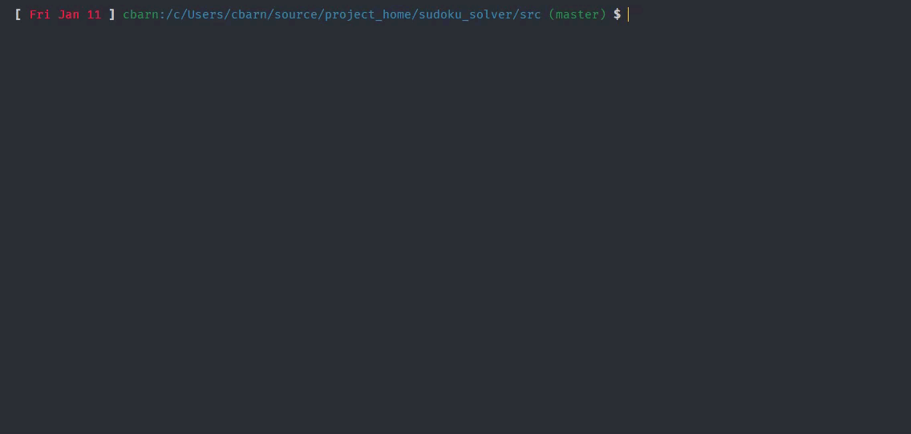

# Sudoku Puzzle Solver

Solves sudoku puzzles!

## Installation

Download the source code and compile with `g++`.  Included `Makefile`.  Here I'm using C++17, but you could just as well compile with C++11 (just swap `-std=c++17` for `-std=c++11`).

## Usage

To enter a (solvable) puzzle, replace the sample puzzle in src/input with the to-be-solved
puzzle, using the format as shown (0 in place of empty squares).  Compile and run the 
created executable.

## License

The MIT License (MIT)

Copyright (c) 2017 C. Barnson

Permission is hereby granted, free of charge, to any person obtaining a
copy of this software and associated documentation files (the "Software"),
to deal in the Software without restriction, including without limitation
the rights to use, copy, modify, merge, publish, distribute, sublicense,
and/or sell copies of the Software, and to permit persons to whom the
Software is furnished to do so, subject to the following conditions:

The above copyright notice and this permission notice shall be included in
all copies or substantial portions of the Software.

THE SOFTWARE IS PROVIDED "AS IS", WITHOUT WARRANTY OF ANY KIND, EXPRESS
OR IMPLIED, INCLUDING BUT NOT LIMITED TO THE WARRANTIES OF MERCHANTABILITY,
FITNESS FOR A PARTICULAR PURPOSE AND NONINFRINGEMENT. IN NO EVENT SHALL THE
AUTHORS OR COPYRIGHT HOLDERS BE LIABLE FOR ANY CLAIM, DAMAGES OR OTHER
LIABILITY, WHETHER IN AN ACTION OF CONTRACT, TORT OR OTHERWISE, ARISING
FROM, OUT OF OR IN CONNECTION WITH THE SOFTWARE OR THE USE OR OTHER
DEALINGS IN THE SOFTWARE.
